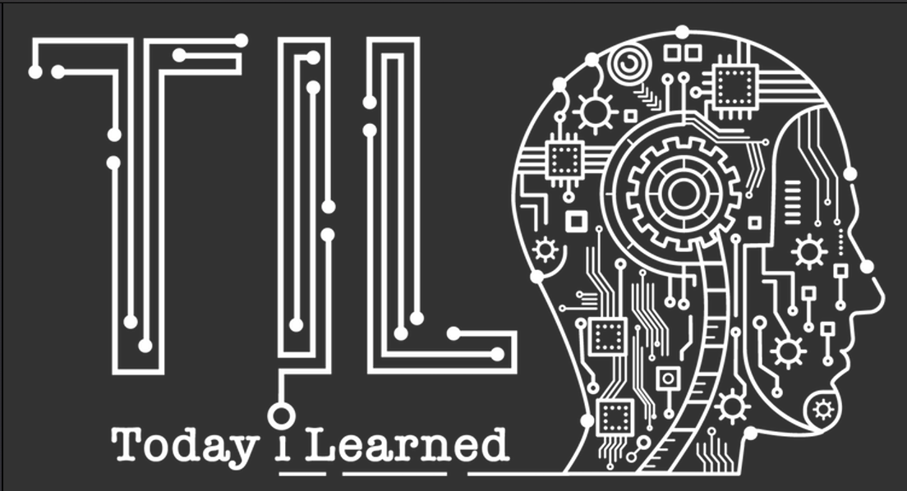

## Long Term Knowledge
- [The Red Queen Effect](https://fundooprofessor.wordpress.com/2012/09/16/red_queen/)
- [Getting the World to Do the Work for You- Joseph Tussman](https://fs.blog/2016/02/joseph-tussman/)
- [Schlep Blindness](./essays/schlep_blindness.md)
- [Lessons From Biology](https://fs.blog/2015/08/will-durant-the-three-lessons-of-biological-history/)
- [We are What we Remember](https://fs.blog/2021/01/we-remember/)
- [Externalities - and then what?](https://fs.blog/2019/09/externalities-why-we-can-never-do-one-thing/)
- [Tragedy of Commons](https://fs.blog/2011/08/the-tragedy-of-the-commons/)
- [Effective Learning](https://fs.blog/learning/)
- [Double loop Learning](https://fs.blog/2018/06/double-loop-learning/)
- [Bayesian Updating](https://fs.blog/2018/09/bayes-theorem/)
- [To Explore or Exploit](https://fs.blog/2020/11/explore-or-exploit-how-to-choose-new-opportunities/)
- [Ideas that can change Life](https://www.collaborativefund.com/blog/ideas-that-changed-my-life/)
- [Process vs outcome](https://fs.blog/2014/07/paula-scher-on-process-versus-outcome/)
- [Models are not exact but useful in certain conditions](https://fs.blog/2017/06/all-models-are-wrong/)
- [Smart Decision Making](https://fs.blog/smart-decisions/)
- [How to not be Stupid](https://fs.blog/2019/01/how-not-to-be-stupid/)
- [How to think](https://fs.blog/2015/08/how-to-think/)
- [Decision Making Process](long_term_knowledge/decision_making_process.md)
- [100 true fans](https://a16z.com/2020/02/06/100-true-fans/)
- [Thinking Rate is Fixed](https://fs.blog/2021/03/thinking-rate-fixed/)
- [Focusing on simplicity](https://fs.blog/2014/12/albert-einstein-simplicity/)
- [Winning a Election](https://fs.blog/2012/03/5-things-cicero-can-teach-you-about-winning-an-election/)
- [Problem Solving](https://fs.blog/2011/05/problem-solving-tools/)
- [Equality](https://fs.blog/2021/03/john-stuart-mills-equality/)
- [Economic Growth](https://eriktorenberg.substack.com/p/on-economic-growth)
- [How to Act](https://fs.blog/2013/10/marcus-aurelius-how-to-act/)
- [On Humour](https://eriktorenberg.substack.com/p/on-humor)
- [Being Special](https://www.mysupersecretdiary.com/p/special)
- [Decentralization of News](https://eriktorenberg.substack.com/p/how-the-internet-ate-media)
- [How to generate Ideas](http://www.paulgraham.com/ideas.html)
- [The fall of Institutions](https://eriktorenberg.substack.com/p/why-are-institutions-failing-us)
- [The Death of Middle](https://eriktorenberg.substack.com/p/the-death-of-the-middle)
- [The Middle men are no longer needed](https://eriktorenberg.substack.com/p/whoever-generates-the-demand-captures)
- [Being a better Manager](https://fs.blog/2016/10/iverson-cure-for-the-common-mba/)
- [Knowledge Makes everything simpler](https://fs.blog/2015/12/knowledge-makes-everything-simpler/)
- [Working hard](https://paulgraham.com/hwh.html)
- [Creating vs Consuming](https://blog.tjcx.me/p/consume-less-create-more)
---
## Android
- [Activity Results API](https://android.jlelse.eu/activity-results-api-69be5a225e86)
- [Android dependency Graph](https://github.com/wajahatkarim3/Today-I-Learned/blob/master/gradle/dependency-graph-project.md)
- [Constraint Layout with percentage](https://github.com/wajahatkarim3/Today-I-Learned/blob/master/android/percent-constraint-layout.md)
- [Vector Assets](https://medium.com/android-dev-hacks/android-vector-drawables-bfb515ba8f2e)
- [Work Manager](https://www.raywenderlich.com/20689637-scheduling-tasks-with-android-workmanager#toc-anchor-002)
- [Problems of defining yourself by your job](https://www.bbc.com/worklife/article/20210409-why-we-define-ourselves-by-our-jobs?utm_source=pocket-newtab-intl-en)
- Pull Apk from Device
    1. get Path
    `adb shell pm path com.example.someapp`
    2. Get APK
    `adb pull /data/app/com.example.someapp-2.apk`
---

## Stoicism
[Lessons From Stoics](./stoic_lessons/lessons_2021.md)

---
## Interesting TidBits
- Python List Comprehension
A list comprehension looks like this:  
`new_list = [f(o) for o in a_list if o>0]`  
This will return every element of `a_list`  that is greater than 0, after passing it to the function f.

- You can use the [ADB accessibility](https://alexzh.com/adb-commands-accessibility/) to change the density of Physical Device or Emulator to test you app UI on small screen devices
    ```
    adb shell wm density //see current density
    adb shell wm density 580 //set a different density
    adb shell wm density reset //reset denity to default
    ```
- You can check out only a subdirectory from a huge git repo. Really helpful when experimenting with google samples.
  - You need git version > 2.19 (GitHub is supported)
  - Do a sparse clone with no blobs and with history depth 1
  ```bash
  git clone \
  --depth 1  \
  --filter=blob:none  \
  --sparse \
    https://github.com/googlesamples/mlkit.git 
    ```
    - This will only clone a empty repo*
    - The enter the repo and sparse-checkout the subdirectory which you need
    ```bash
    git sparse-checkout set android/material-showcase
    ```
---
## Machine Learning
- [Neural Networks](./machine_learning/neural_networks.md)
---
## Tools
- [Switch On a PC remotely](./systems/wake_on_lan.md)
- [vscode-snippet (Easily search common code snippets)](https://github.com/mre/vscode-snippet)
- [using launchd to run cron jobs](https://blog.jan-ahrens.eu/2017/01/13/cron-is-dead-long-live-launchd.html)
- [Espanso](https://espanso.org/)  Really cool utility which you can use to create text substitution
- [AWK](https://ferd.ca/awk-in-20-minutes.html)
- [Redux Thunk](https://alialhaddad.medium.com/how-to-use-redux-thunk-in-react-and-react-native-4743a1321bd0)
- [Optimizing Big query Execution](https://medium.com/slalom-build/using-bigquery-execution-plans-to-improve-query-performance-af141b0cc33d)

---
## MacOS
- Command-Option-C will copy the file path
- Holding control during screenshot will copy directly to clipboard


## Fundentals Revisit
- [Multi Digit Multiplication](https://www.khanacademy.org/math/arithmetic/arith-review-multiply-divide)
- [Kotlin Collections](./fundamentals/kotlin_collections.md)
- [SQL](https://mystery.knightlab.com/walkthrough.html)
- [GitFlow](https://www.atlassian.com/git/tutorials/comparing-workflows/gitflow-workflow)
- [Design Patterns](https://www.raywenderlich.com/18409174-common-design-patterns-and-app-architectures-for-android)
- [SQL Best Practices](./fundamentals/SQL.md)
- [Firebase Gotchas](./fundamentals/firebase.md)

## Entrepreneurship
- [Atomic Concepts of a Product](https://kwokchain.com/2021/02/05/atomic-concepts/)

### Life Lessons
- You won't get anywhere by making other people feel stupid, no matter how correct you are.
- Being kind is harder than being clever.
---
Inspired by [ashandilya](https://github.com/ashandilya)
