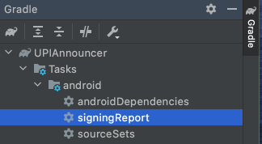

# FireBase

### SetUp
- Easy way to get Signing SHA1 and SHA256 signatures from Android studio

### RealTime Database
- Realtime Database = charges on bandwidth and storage
- Firestore Database charges on operation.
- If you are using a non default location then you need to update google_services.json
- Table structure is path based
- `addListenerForSingleValueEvent` looks up **Only** local cache
-  Use `get()` if you want to just fetch latest data once and don't care for updates.
-  Array is not compatible have to convert it to List